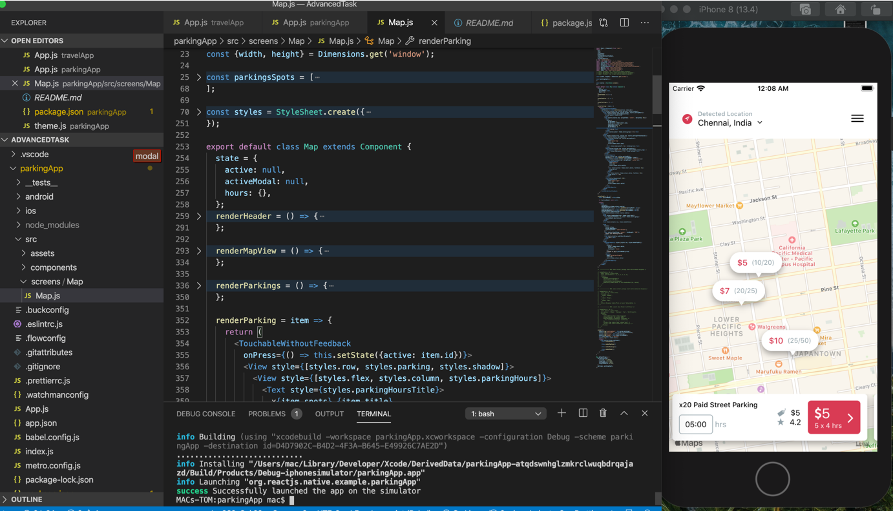
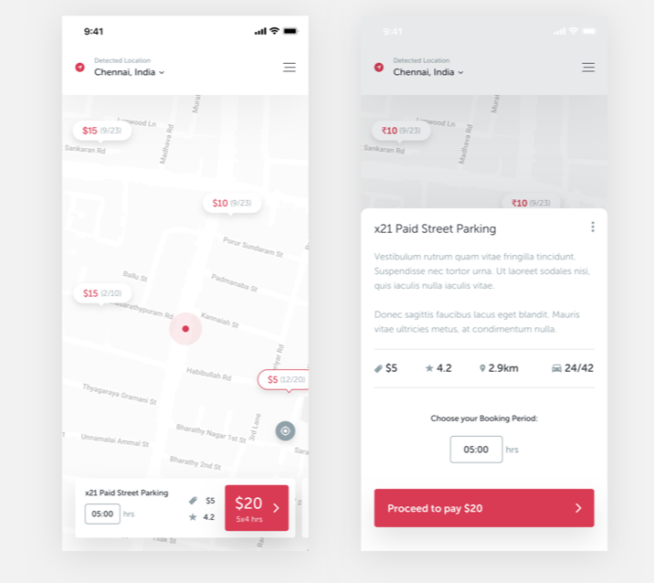
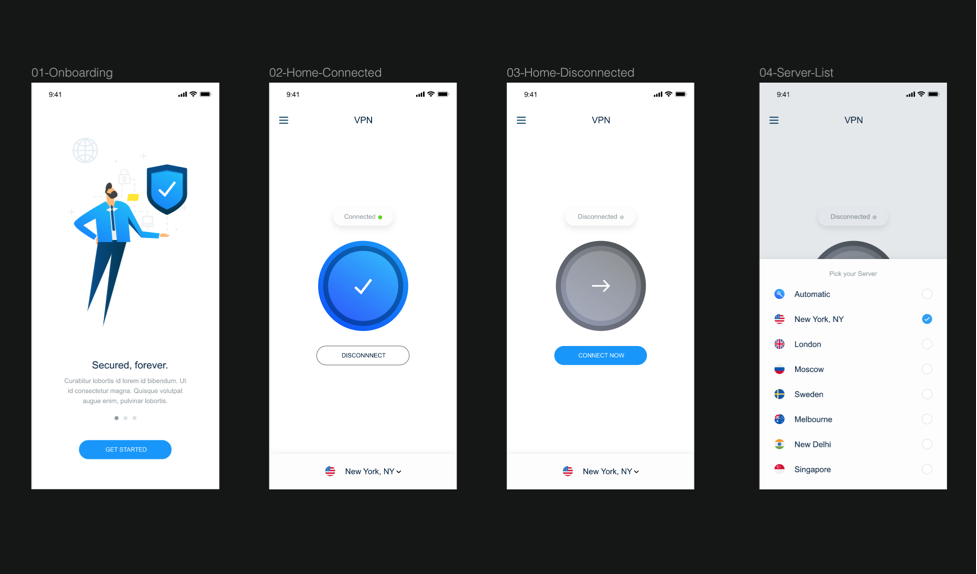
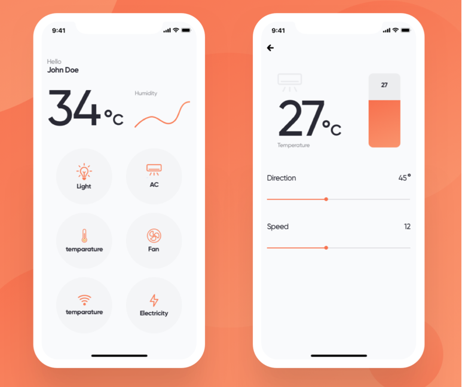

##### Especially thanks to [React-UI-Kit](https://www.youtube.com/channel/UCfREdW8U8p9AHDZwau3lapw/about) Channel !
# ReactNative Project 2020

**I'm transforming Dribbble designs to React / React-Native code. Happy Coding :)**

### Overview
| Project | Name | Description | Status | 
| ------ | ------ | :------: | :------: | 
| 01 | Travel App | Travel article news with main & details UI view | 100% :white_check_mark: |
| 02 | Parking App | Car parking finder app with price calculator | 90% :hammer_and_wrench: |
| 03 | VPN App | Vitural Private Network app with select country | 100% :white_check_mark: |
| 04 | Home App | iOT simulator app for controlling devices in home | 100% :white_check_mark: |
| 05 || *To be continued :)* ||

## Project 1: Travel Article App UI	View Snack	✅

### Design sketch link [here](https://camo.githubusercontent.com/7a5c07fe2cf40e5401dbee62a94994f82a4b0bc9/68747470733a2f2f63646e2e6472696262626c652e636f6d2f75736572732f313633313630372f73637265656e73686f74732f353731373931372f6174746163686d656e74732f313233343835312f5f5f5f5f2d312e302e706e67)

### Demo design:

### UI View:  2

### Coding time: 8 hours.
### Description:
1. Flatlist & Scrollview Image Gallery
2. Animated dots progress/stepper ( horizontal in Flatlist ) 
3. Rating star 

### Dependencies: 
    "@react-native-community/masked-view": "^0.1.7",
    "@react-navigation/native": "^5.1.4",
    "@react-navigation/stack": "^5.2.9",
    "react-native-gesture-handler": "^1.6.1",
    "react-native-reanimated": "^1.7.1",
    "react-native-safe-area-context": "^0.7.3",
    "react-native-screens": "^2.4.0",
    "react-native-vector-icons": "^6.6.0"
    "react-native": "0.62.1",

### Issue & Resolve: Check it [here](https://github.com/tomhagen/dribble2ReactNative/issues)

 

## Project 2: Car Parking Finder App	✅

### Design sketch link [here](https://camo.githubusercontent.com/8601ada4322a6ce79b90eadc3f41349b018e07c8/68747470733a2f2f63646e2e6472696262626c652e636f6d2f75736572732f3338363838332f73637265656e73686f74732f353336313738302f6174746163686d656e74732f313136323532382f30373130323031382d64657369676e2e706e67)

### Demo design:

### UI View:  2

### Coding time: 7 hours.
### Description:
- React Native Map, React Native Map Marker
- React Native FlatList, React Native ScrollView , 
- React Native Modal

### Dependencies: 
    "react-native-dropdown": "0.0.6",
    "react-native-maps": "^0.27.1",     // for testing
    "react-native-material-dropdown": "^0.11.1",     // for testing
    "react-native-modal": "^11.5.6",    // for testing
    "react-native-modal-dropdown": "^0.7.0",    // for testing
    "react-native-vector-icons": "^6.6.0"
      "react-native": "0.62.2",

### Issue & Resolve: Check it [here](https://github.com/tomhagen/dribble2ReactNative/issues)

### Unfinished Task: 
- Using React-Native-dropdown for render hours
- Calculating the price and render the same hours ( with main view ) in modal view 

 

## Project 3: VPN App	✅

### Design sketch link [here](https://camo.githubusercontent.com/a2b9a05f6c2977425df30ead06e36f5748a2fea4/68747470733a2f2f70726f6a6563743336352e64657369676e2f77702d636f6e74656e742f75706c6f6164732f323031382f31302f30353130323031382d64657369676e2e706e67)

### Demo design:

### UI View:  2

### Coding time: 8 hours.
### Description:
- React Native Navigation
- React Native ScrollView , 
- React Native Modal
- React Native vector icon
- Using state to turn on/off connected status and picker country

### Dependencies: 
   "@react-native-community/masked-view": "^0.1.8",
    "@react-navigation/native": "^5.1.5",
    "@react-navigation/stack": "^5.2.10",
    "react": "16.11.0",
    "react-native": "0.62.2",
    "react-native-gesture-handler": "^1.6.1",
    "react-native-modal": "^11.5.6",
    "react-native-reanimated": "^1.8.0",
    "react-native-safe-area-context": "^0.7.3",
    "react-native-screens": "^2.4.0",
    "react-native-vector-icons": "^6.6.0"

### Issue & Resolve: Check it [here](https://github.com/tomhagen/dribble2ReactNative/issues)

 

## Project 4: Home App	✅

### Design sketch link [here](https://camo.githubusercontent.com/d8057ab9716ab6c32fdc98fd21642b56a498194c/68747470733a2f2f63646e2e6472696262626c652e636f6d2f75736572732f3936383335342f73637265656e73686f74732f343538353234332f6174746163686d656e74732f313033363637392f736d6172745f686f6d655f6170705f75695f6174746163686d656e742e706e67)

### Demo design:

### UI View:  2

### Coding time: 8 hours.
### Description:
- React Native Navigation 
- React Native SVG Chart
- React Native vector icon
- Using PanResponder for marking PanSlider
- Special: Idea for marking Block component ( handmade ) instead of View

### Dependencies: 
     "@react-native-community/masked-view": "^0.1.9",
    "@react-navigation/native": "^5.1.5",
    "@react-navigation/stack": "^5.2.10",
    "react": "16.11.0",
    "react-native": "0.62.2",
    "react-native-gesture-handler": "^1.6.1",
    "react-native-reanimated": "^1.8.0",
    "react-native-safe-area-context": "^0.7.3",
    "react-native-screens": "^2.4.0",
    "react-native-svg": "^12.1.0",
    "react-native-svg-charts": "^5.3.0",
    "react-native-vector-icons": "^6.6.0"

### Issue & Resolve: Check it [here](https://github.com/tomhagen/dribble2ReactNative/issues)

