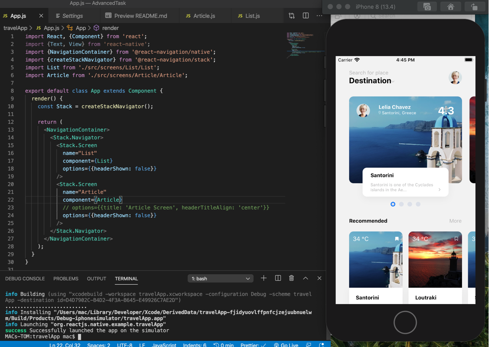
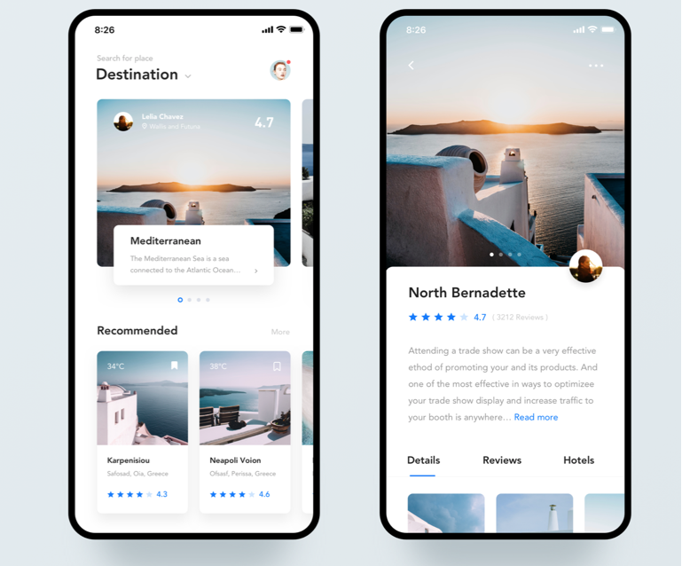

# ReactNative Project 2020

**I'm transforming Dribbble designs to React / React-Native code. Happy Coding :)**

## Project 1: Travel Article App UI	View Snack**	✅

## Design sketch link --> [here](https://camo.githubusercontent.com/7a5c07fe2cf40e5401dbee62a94994f82a4b0bc9/68747470733a2f2f63646e2e6472696262626c652e636f6d2f75736572732f313633313630372f73637265656e73686f74732f353731373931372f6174746163686d656e74732f313233343835312f5f5f5f5f2d312e302e706e67)

## Demo design:

## UI View:  2

## Coding time: ##### 7 hours.
## *Description:
1. Flatlist & Scrollview Image Gallery
2. Animated dots progress/stepper ( horizontal in Flatlist ) 
3. Rating star 

## Package using: 
1. React-native-navigation-stack 5.2
2. React-native-vector-icon 
Reac-native version 0.62

## Issue & Resolve: ##### Check it [here](https://github.com/tomhagen/dribble2ReactNative/issues)
